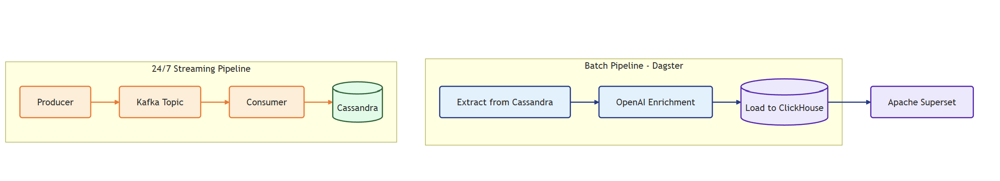
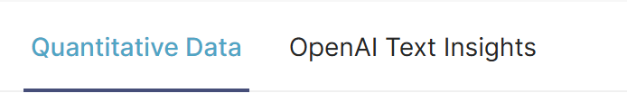
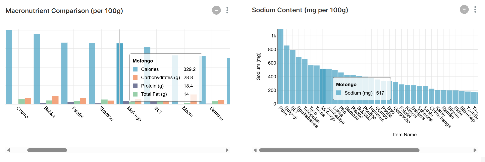
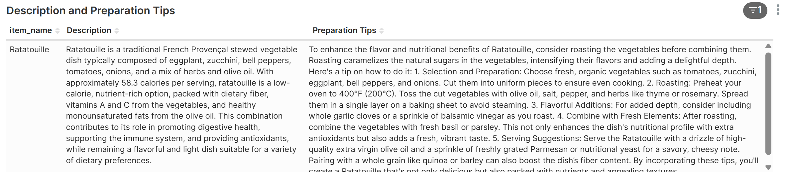

# Hybrid Nutrition Data Pipeline – Batch & Streaming

This project simulates a real-time and batch data pipeline for food item enrichment and nutritional analytics. It demonstrates a modern architecture that uses Kafka for streaming ingestion, Cassandra for NoSQL storage, Dagster for orchestration, ClickHouse for analytics, and Apache Superset for interactive dashboards.

## 🧠 Project Overview

The system operates with two integrated layers:

### 🔄 Real-Time Streaming Pipeline
- **Producer** (`produce_items.py`):  
  Uses OpenAI to generate random food item names (e.g., “Avocado Toast Supreme”) and publishes them continuously to a Kafka topic.

- **Consumer** (`consume_items.py`):  
  Listens to the Kafka topic, fetches nutritional data (calories, macronutrients, etc.) from a Nutrition API, and stores the raw information in **Cassandra**.

### ⏱️ Batch Pipeline with Dagster
- **Extract**: Pulls raw food records from Cassandra.
- **Enrich**: Uses OpenAI to generate descriptive content (e.g., preparation tips, food context).
- **Load**: Writes the enriched data into **ClickHouse** for analytics.

## 🗺️ Architecture Diagram



## 📊 Dashboard Structure (Apache Superset)

### 1. Tab Navigation – Quantitative vs. Text Insights  
 

The dashboard is split into two perspectives:
- **Quantitative Data**: Charts for calories, macronutrients, and sodium
- **OpenAI Text Insights**: Descriptions, preparation tips, and pairings 
 
This design clearly separates numeric from generative content.

---

### 2. Macronutrient & Sodium Analysis  
 

Bar charts compare:
- Calories, Protein, Carbohydrates, and Total Fat per 100g
- Sodium content by item  

Helps users understand which foods are energy-dense or high in salt.

---

### 3. AI Descriptions & Cooking Tips  

 
Text generated using OpenAI includes:
- Nutritional summaries
- Health benefits
- Cooking recommendations  

Adds meaningful context and preparation value to raw food data.

---

### 4. Word Cloud: Best Pairings  

  
Displays top ingredient pairings for each item (e.g., “Polenta”, “Salad”, “Pasta”, “Couscous”, “Eggs”), offering inspiration for complementary dishes.


## 📂 Key Files

```
/producer/
  └── produce_items.py

/consumer/
  └── consume_items.py

/dagster_project/
  └── pipeline.py

/superset/
  └── superset_config.py

/.github/workflows/
  └── ci.yml

/docker-compose.yml
/pyproject.toml
```

---

## 🧰 Tech Stack

### Languages & Tools
- Python
- Poetry

### Streaming & Orchestration
- Apache Kafka
- Dagster

### Databases & Storage
- Cassandra
- ClickHouse

### Infrastructure
- Docker Compose
- Google Cloud Compute Engine

### CI/CD
- GitHub Actions

### BI & Visualization
- Apache Superset


